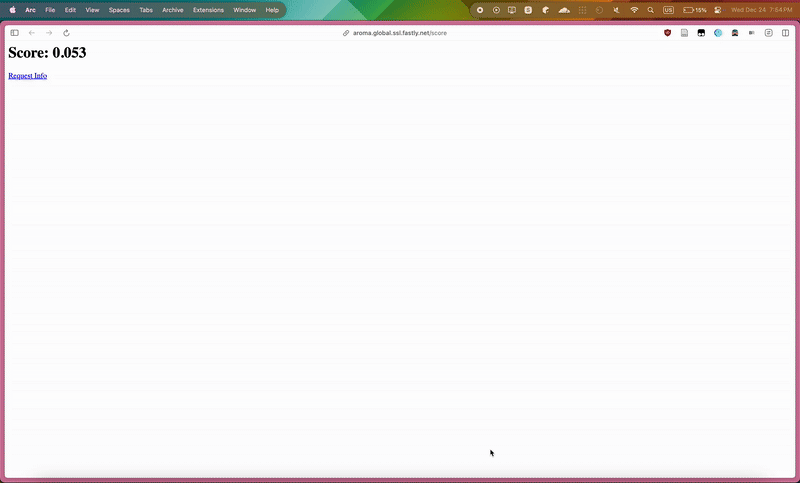
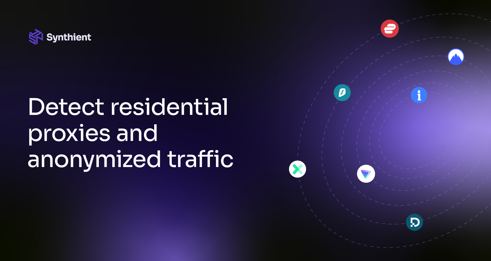

# Aroma: Every TCP Proxy Is Detectable With RTT Fingerprinting
> [!IMPORTANT]
> - Aroma does not use any kind of IP intelligence information, although IP intelligence information can be used to complement Aroma.
> - Currently the score needed for detection is very low to avoid false positives, so even if it doesn't detect the proxy it may give a low score (0.3-0.1 is very low but does not flag as proxy).
> - The current code is not ready for production, it's just to prove a point.
> - Aroma does not currently detect VPNs or any kind of proxy which isn't a TCP Proxy, Aroma may detect VPNs that use TCP Proxying and the techniques used in Aroma are not limited to TCP and can be applied to other kinds of proxies, but for simplicity and technical reasons (there are variables of the connection that Fastly does not expose to me).

A demo of Aroma detecting Cloudflare WARP (higher score is better):

> [!NOTE]
> I have to admit I was a bit surprised that Aroma was detecting WARP, since I thought it was a VPN, but apparently it acts like a UDP => TCP proxy. If Aroma doesn't detect your VPN, that's normal and means your VPN is doing Layer 3 proxying. If your VPN is detected it's doing Layer 4 proxying (some privacy VPNs do this on web ports for privacy reasons).

# Demo
If you want to check out Aroma for yourself, you can go to: 

[https://aroma.global.ssl.fastly.net/](https://aroma.global.ssl.fastly.net/).

And you should see an "allowed" page if you are not using a TCP Proxy and a block page if you are using a proxy.

If you want to get your score you can go to [https://aroma.global.ssl.fastly.net/score](https://aroma.global.ssl.fastly.net/score).

# SPONSORS
## [Synthient](https://synthient.com)

> [Synthient provides real-time data on residential proxies, VPNs and malicious IP addresses enabling businesses to detect fraudulent traffic.](https://synthient.com)

# TL;DR explanation
This is done by measuring the minimum TCP RTT ([client.socket.tcpi_min_rtt](https://www.fastly.com/documentation/reference/vcl/variables/client-connection/client-socket-tcpi-min-rtt/)) seen and the smoothed TCP RTT ([client.socket.tcpi_rtt](https://www.fastly.com/documentation/reference/vcl/variables/client-connection/client-socket-tcpi-rtt/)). I am getting this data by using Fastly Custom VCL, they get this data from the Linux kernel (struct [tcp_info](https://github.com/torvalds/linux/blob/ccd1cdca5cd433c8a5dff78b69a79b31d9b77ee1/include/uapi/linux/tcp.h#L229) -> [tcpi_min_rtt](https://github.com/torvalds/linux/blob/ccd1cdca5cd433c8a5dff78b69a79b31d9b77ee1/include/uapi/linux/tcp.h#L279) and [tcpi_rtt](https://github.com/torvalds/linux/blob/ccd1cdca5cd433c8a5dff78b69a79b31d9b77ee1/include/uapi/linux/tcp.h#L259)). I am using Fastly for the Demo since they have PoPs all around the world and they expose [TCP socket data](https://www.fastly.com/documentation/reference/vcl/variables/client-connection/) to me.

The score is calculated by doing `tcpi_min_rtt`/`tcpi_rtt`. It's simple but it's what worked best for this with [the data Fastly gives me](https://www.fastly.com/documentation/reference/vcl/variables/client-connection/). Based on my testing, 1-0.7 is normal, 0.7-0.3 is normal if the connection is somewhat unstable (WiFi, mobile data, satellite...), 0.3-0.1 is low and may be a proxy, anything lower than 0.1 is flagged as TCP proxy by the current code.

# Hosting this yourself
> [!WARNING]
> The current code is not production-ready.
First of all, the things on the `oldcode/` folder are old Python code that I was using to do some testing, it's not complete code but feel free to make a PR if you want to make the server complete, I don't mind :)

If you want to use Fastly, you can upload `aroma.vcl` to [Custom VCL](https://www.fastly.com/documentation/guides/full-site-delivery/fastly-vcl/working-with-custom-vcl/) on Fastly.

If you want to modify anything, you can edit `aroma.vcl.tpl` and run `build_vcl.py` to generate a new `aroma.vcl` file. Then you can upload the file following the previous instructions.

If you want to host this somewhere else, this README file explains how this works. Using that information you can make the code for it to run wherever you want.

# Boring technical explanation
## Special Relativity
According to Special Relativity, information cannot travel faster than the speed of light.

Therefore, if the round trip time (RTT) is 4ms, it's physically impossible for them to be farther than 2 light milliseconds away, which is approximately 600 kilometers.

We can do some assumptions, for example, light travels approximately 33% slower in fiber optic cables, so the distance is likely less than 400 kilometers away. Depending on their hop count, we can further narrow this down, we can also use information about the route, but as a proof of concept I'll use a simpler method.

## Network timing is way more than just RTT
There is no single RTT, at the very least you have Layer 3 RTT, Layer 4 RTT (TCP), layer 7 RTT (HTTP), and if it's encrypted, you probably also have TLS RTT.

There is also an initial RTT, a client hello delay, and many other timings. Wikipedia has a [great article](https://en.wikipedia.org/wiki/Network_delay) on the topic.

## What can we do with this?
Well, in a normal connection, all the RTT measurements should be somewhat similar once we account for protocol overhead and we use smoothed values to account for jitter.

But proxies will make it so the RTT measurements over the protocol of the proxy go up. For example, if the proxy is a TCP proxy, the HTTP RTT and the TLS RTT will be higher than the TCP RTT and layer 3 RTT.

Continuing the example, let's say the proxy user is in Australia, and the proxy is in the United States, the proxy connects to a server, ideally we would have as many servers as possible around the world, so let's say the proxy connects to a server very near to it and it has a 10ms RTT (Based on my testing with Fastly, the TCP RTT for a request to the closest Fastly edge server is usually less than 1ms, and from my computer I get about 10ms RTT, and I don't have a particularly good connection).

Because the proxy user is in Australia, let's say the proxy user has 160ms RTT to the proxy.

In this example, the proxy would see 10ms RTT for L3 and L4 (TCP RTT), but 170ms RTT for TLS and HTTP, the HTTP RTT can be measured by seeing how long it takes to follow a redirect or fetch some resource like CSS or JavaScript.

For the situations where we can see the proxy RTT to be less than 1ms. The client using the proxy is limited to very near proxies to avoid meaningfully increasing the proxy RTT.

A simple algorithm for calculating the score would be (`proxy RTT`)/(`non-proxy RTT`), which is what I will be doing in this proof of concept.

Any sufficiently large internet service can collect all the network timing data they can, get a baseline, compare it to the data known proxies generate, and with this be able to create scoring algorithms that measure the proxy likelyhood.

# Contact
You can reach out to me here:
[aroma_contact@proton.me](mailto:aroma_contact@proton.me)
